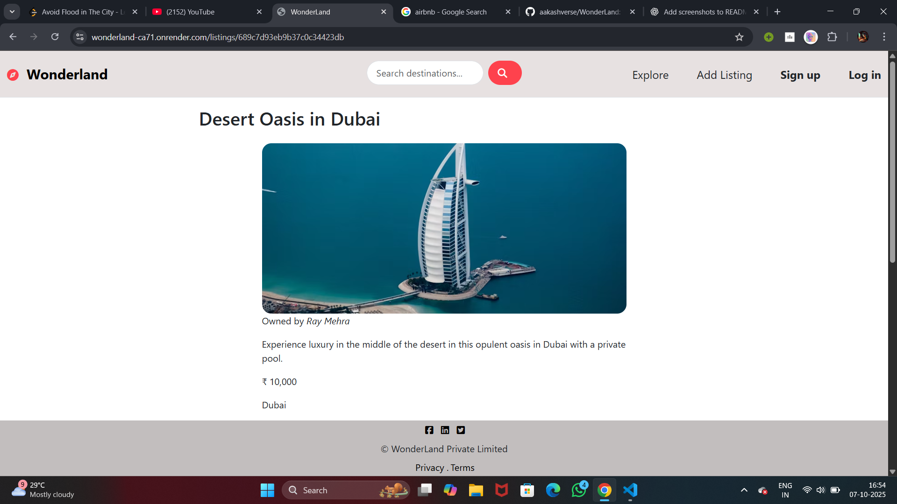

# 🌍 Wonderland — Discover Places, Seamlessly

**Wonderland** is a responsive full-stack web application that lets users search rated rentals for your next trip - holiday homes, cabins, unique stays & more. Find homes perfect for any trip: vacations.... Built with **Tailwind CSS** for modern, scalable styling and designed with a focus on user experience, responsiveness, and clean architecture.

> 🔥 Designed to scale — from mobile to desktop.  
> 🎯 Built with job-ready, production-standard frontend practices.

---

## 🖼 Preview

### Home Page


### Listing Info

(public/assets/ListingInfo2.png)

### New Listing 


### Rating & Review Section


---

## 🚀 Key Features

- 🔍 **Smart Search:** Clean, centered search bar with semantic accessibility.
- 📱 **Mobile-first Navbar:** Toggle-based navigation with conditional rendering (auth-aware).
- 🎨 **Tailwind-Powered UI:** BootStrap classes & custom utility-first design.
- 🧠 **Auth-aware UX:** Login, logout, and registration dynamically shown.
- 🧭 **Custom Logo UI:** Large compass icon integrated as a brandable visual identity.
- ✨ **Fully responsive:** Seamlessly adapts from small screens to wide desktops.

---

## ⚙️ Tech Stack

| Layer       | Technology                |
|-------------|---------------------------|
| **Frontend**| HTML5, Tailwind CSS, Font Awesome |
| **Templating** | EJS (server-side rendering) |
| **Backend** | Node.js, Express |
| **Auth**    | Express-session / Passport |
| **Icons**   | Font Awesome               |           
| **CSS**     | BootStrap & Tailwind Utility Classes Only |

---

## 📁 Folder Structure

```bash
.
├── public/
│   ├── css/
│   ├── js/
├── models/
│   ├── listing/
│   ├── review/
│   ├── user/
├── views/
│   ├── partials/
│   └── listings/
├── controllers/
│   ├── listings/
│   ├── reviews/
│   ├── users/
├── routes/
│   └── listing.js
│   └── review.js
│   └── user.js
├── app.js            # Entry point
└── README.md


## 🛠 Getting Started

### 1. Clone the repo

```bash
git clone https://github.com/aakashverse/wonderland.git
cd wonderland
node app.js
